#### 基于Java+springboot的超市管理系统(源代码+数据库)003

#### 一、系统介绍：

商品管理：商品管理、分类管理、预警商品

进货管理：超市退货、供应商管理

库存管理：商品入库、商品出库

销售管理：销售订单、销售退货、客户管理

财务管理：财务分析

人事管理：部门管理、用户管理、请假管理、个人请假

系统设置：用户管理、角色管理、菜单管理、部门管理、岗位管理、日志管理

权限划分

超级管理员：拥有所有权限

销售人员：销售管理、库存管理

采购人员：商品管理、进货管理

人事：人事管理

普通员工：库存管理

#### 二、所用技术
主要技术：springboot，java，mysql，thyemleaf，shiro,mybatisplus

#### 三、环境介绍

推荐环境配置：idea/eclipse  jdk1.8  maven3.6  mysql5.7（需要远程可私聊）

#### 四、运行截图
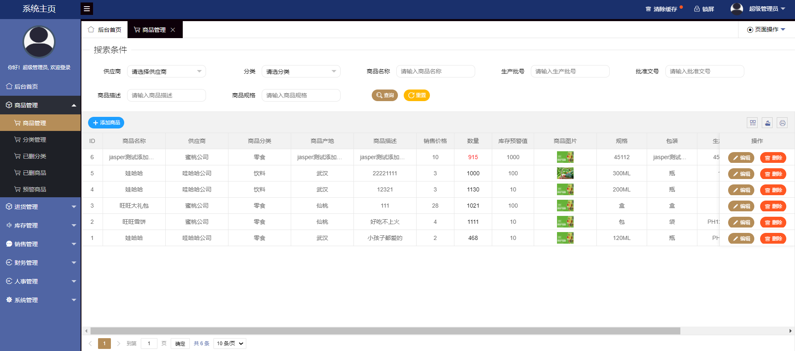
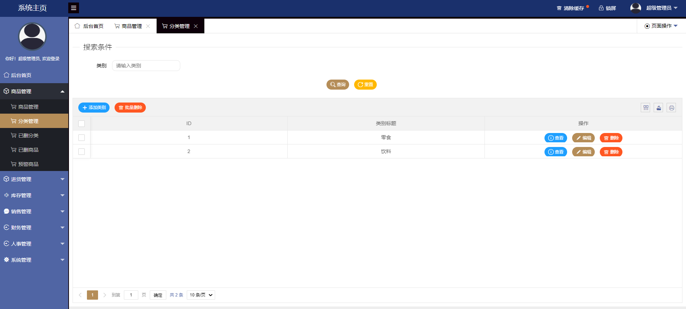
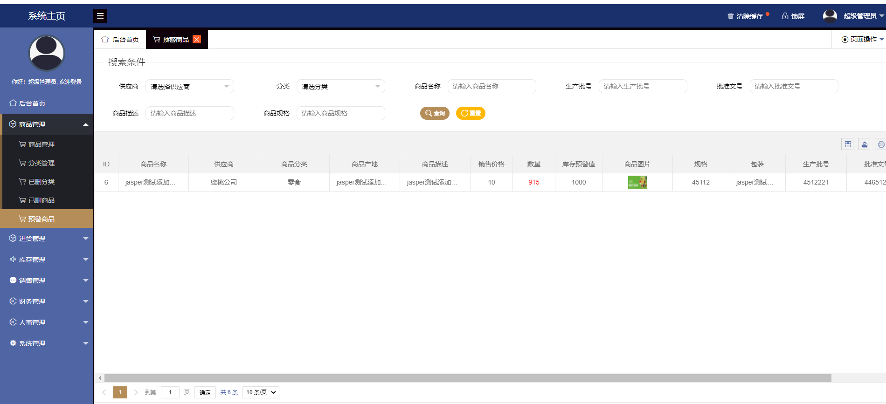
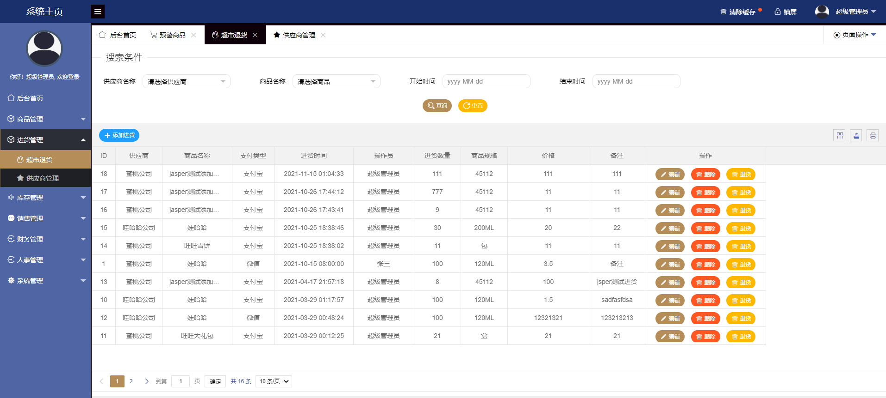
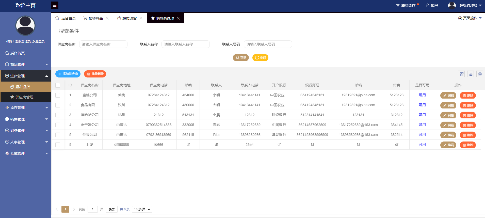
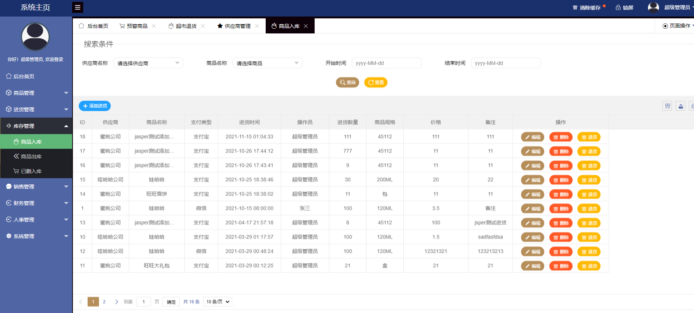
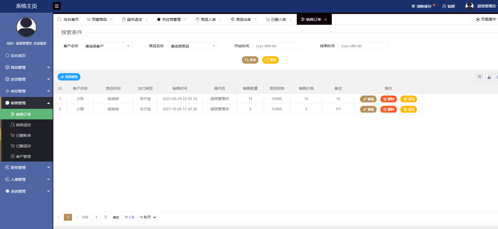
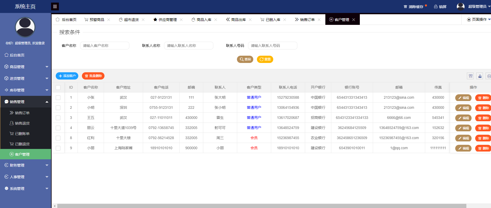
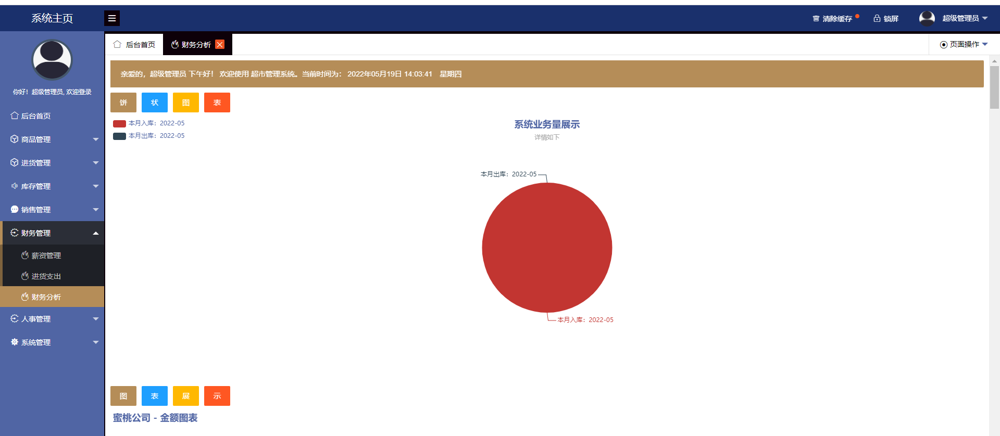
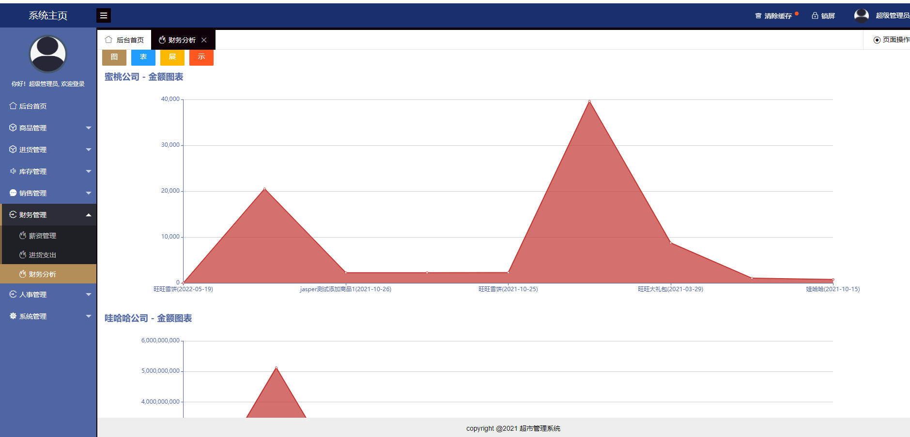
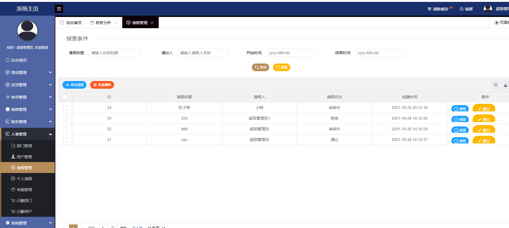
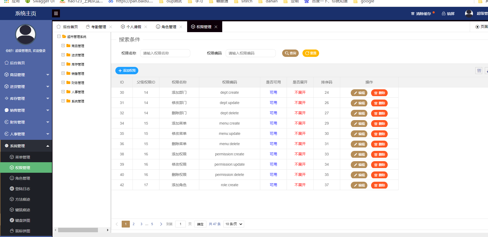
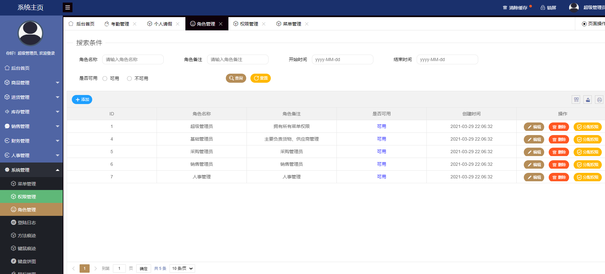
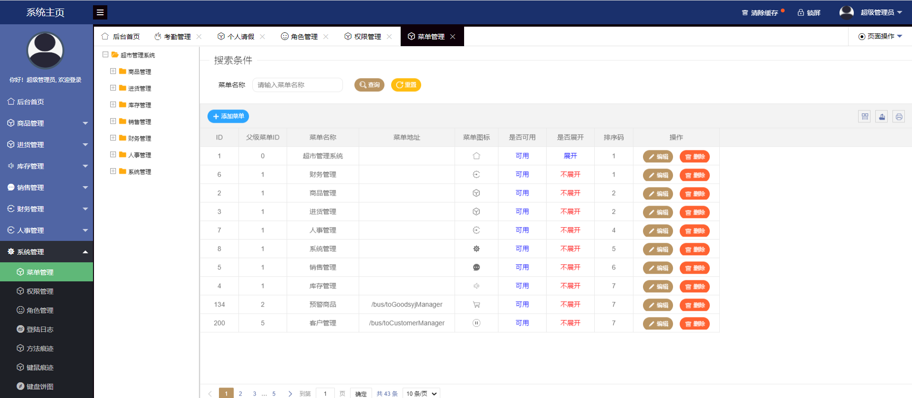
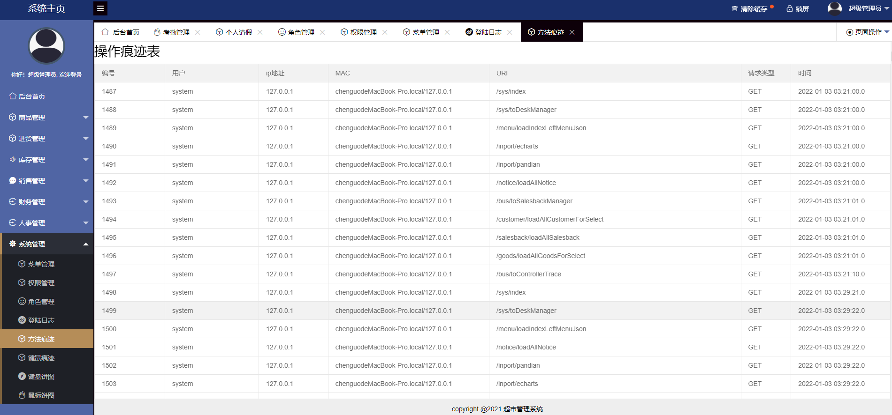

#### 五、浏览地址

前台地址
http://localhost:8084
用户名：admin   密码：123456

## 六、部署教程

1. 使用Navicat或者其它工具，在mysql中创建对应名称的数据库，并执行项目的sql文件；
2. 使用IDEA/Eclipse导入项目，若为maven项目请选择maven，等待依赖下载完成；
3. 进入src/main/resources修改application.yml 里面的数据库配置
4. 启动项目 
